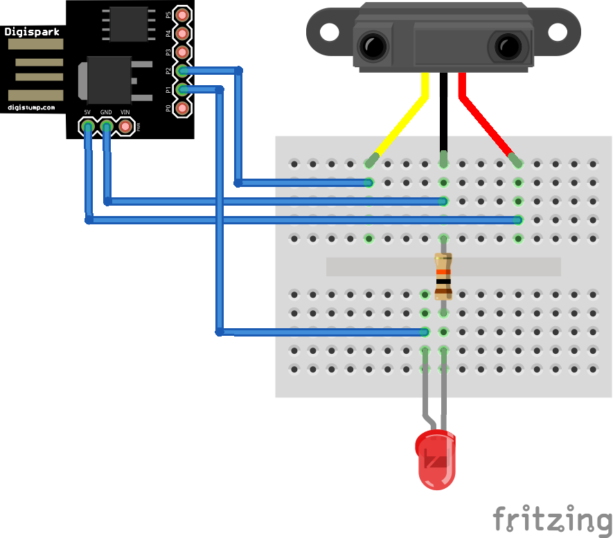

# Digispark Touchless Presenter

A gadget that uses an infrared proximity sensor to turn PowerPoint pages.

## How to Use
- Connect Digispark to USB.
- Wait a few seconds and Digispark will recognize it as a keyboard.
- When you hold your hand over the proximity sensor, the right cursor key is entered. The page advances in presentation mode.

## Circuit Diagram

